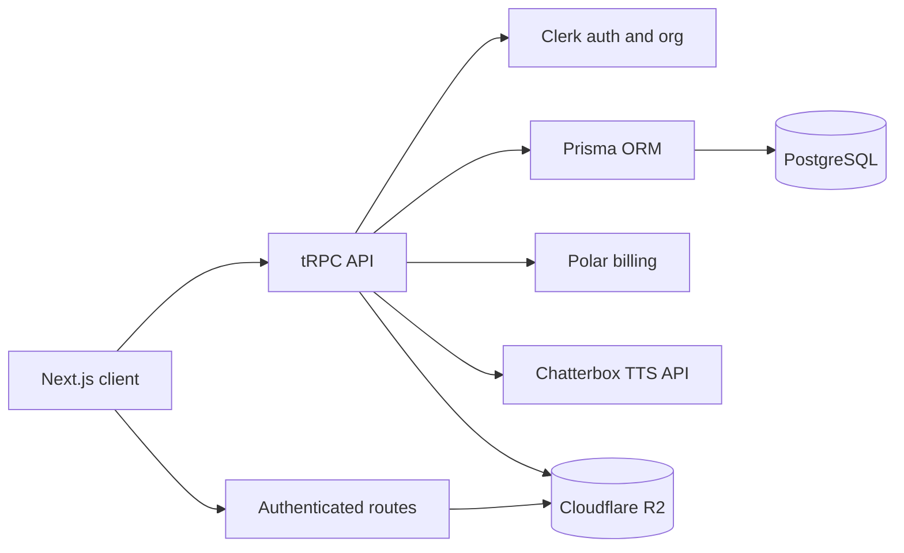

# Resonance

Resonance is a multi-tenant text-to-speech workspace for turning written content into audio. Users work inside a Clerk organization, choose built-in or organization-owned voices, tune generation parameters, and listen to generated audio. Polar handles subscription access and usage events, while PostgreSQL and Cloudflare R2 provide application and media storage.

> **Project status:** Resonance is actively developed. The dashboard, voice library, custom voice upload, text-to-speech generation, audio playback, organization isolation, and subscription-gated workflows are implemented.

## 🚀 Project overview

The main workflow is:

1. A signed-in user selects an organization.
2. The user chooses a built-in voice or creates an organization-specific custom voice.
3. The user enters text and adjusts generation controls.
4. Resonance verifies that the organization has an active Polar subscription.
5. The server sends the request to the Chatterbox speech service.
6. The generated WAV audio is stored in Cloudflare R2 and metadata is stored in PostgreSQL.
7. The user opens the generation page and plays the audio.

Every organization-scoped query checks the active Clerk organization ID. Custom voices, generations, and audio objects are isolated between organizations.

## ✨ Features

### Text-to-speech generation

- Generate speech from text with a selected voice.
- Supports up to 5,000 characters per generation.
- Controls for temperature, top-p, top-k, and repetition penalty.
- Server-side validation for all generation parameters.
- Generation records preserve the source text, selected voice, and settings.
- Generated WAV audio is delivered through an authenticated route.

### Voice library and custom voices

- Browse built-in system voices and organization-owned custom voices.
- Search by voice name or description.
- Categories include audiobook, conversational, customer service, general, narrative, characters, meditation, podcast, advertising, voiceover, and corporate.
- Preview voice audio before using it.
- Upload a custom sample up to 20 MB with a minimum duration of 10 seconds.
- Validate audio metadata before storage, then store metadata in PostgreSQL and audio in Cloudflare R2.
- Delete organization-owned voices with R2 cleanup.

### Authentication and organizations

- Clerk handles sign-in, sign-up, and organization context.
- Protected procedures require an authenticated user and active organization.
- Custom data is scoped by `orgId`, preventing cross-organization access.

### Subscriptions and usage

- Polar checkout sessions are created for the configured product.
- Text-to-speech generation and custom voice creation require an active subscription.
- Users can open the Polar customer portal to manage subscriptions.
- The dashboard can display subscription status and estimated metered usage.
- Generation and voice creation submit `tts_generation` and `voice_creation` usage events to Polar.
- Missing subscriptions produce a **Subscribe** action in the client notification.

### Reliability and observability

- Sentry captures tRPC activity and generation lifecycle logs.
- Failed generations clean up partially created records where possible.
- Audio delivery uses one-hour signed R2 URLs rather than exposing bucket credentials.

## 🏗️ Architecture / workflow



### Generation flow

`generations.create` validates the subscription, checks voice ownership, sends text and generation settings to Chatterbox, creates a `Generation` record, uploads WAV data to `generations/orgs/{orgId}/{generationId}` in R2, and submits a Polar usage event.

### Custom voice flow

`/api/voices/create` validates the organization subscription, metadata, file size, content type, audio format, and duration. It creates a `Voice` record, uploads the source file to `voices/orgs/{orgId}/{voiceId}`, and submits a Polar usage event.

### Audio flow

Authenticated audio routes verify organization ownership, create a one-hour signed R2 URL, fetch the object, and stream it as `audio/wav`. Audio is not served from a public bucket.

## 🛠️ Tech stack

- Next.js 16, App Router, Turbopack, React 19, and TypeScript
- Tailwind CSS 4, Base UI/shadcn-style components, and Lucide icons
- Clerk for authentication and organizations
- Prisma 7 with PostgreSQL
- tRPC 11, TanStack React Query, and TanStack Form
- Zod for runtime validation and SuperJSON for tRPC transformation
- Chatterbox API for speech generation
- Cloudflare R2 through the AWS S3-compatible SDK
- Polar SDK 0.49.0 for checkout, customer sessions, subscriptions, and usage
- Sentry for error tracking and observability
- `music-metadata` for uploaded audio validation

## 📁 Project structure

```text
resonance/
├── prisma/                         # Schema and migrations
├── public/                         # Static assets
├── scripts/                        # Seeding and API synchronization scripts
├── src/app/                        # Next.js pages and route handlers
│   ├── (dashboard)/                # Authenticated dashboard screens
│   └── api/                        # Audio, voice, Sentry, and tRPC routes
├── src/components/                 # Shared UI components
├── src/features/                   # Dashboard, billing, TTS, and voice features
├── src/generated/prisma/           # Generated Prisma client
├── src/hooks/                      # Shared React hooks
├── src/lib/                        # Database, R2, Polar, and Chatterbox clients
├── src/trpc/                       # Context, clients, server helpers, routers
└── src/types/                      # Shared and generated types
```

Important modules include `src/trpc/routers/generation.ts`, `src/trpc/routers/voices.ts`, `src/trpc/routers/billing.ts`, `src/lib/r2.ts`, and `src/lib/chatterbox-client.ts`.

## ⚙️ Installation & setup

### Prerequisites

- Node.js 20 or newer and npm 10 or newer
- PostgreSQL
- Clerk with organizations enabled
- Polar organization, product, and access token
- Cloudflare R2 bucket and S3-compatible credentials
- Reachable Chatterbox API deployment

### Install and configure

```bash
git clone <repository-url>
cd resonance
npm install
```

Create `.env` using the variables below, then initialize the database:

```bash
npx prisma migrate deploy
npx prisma generate
```

For local schema development use `npx prisma migrate dev`. Seed built-in voices with:

```bash
npx tsx scripts/seed-system-voices.ts
```

Review the seed script before running it against an existing production database.

## 🔐 Environment variables

Never commit `.env` or expose server-only secrets in browser code.

| Variable | Required | Description |
| --- | --- | --- |
| `APP_URL` | Yes | Public URL used by checkout redirects, such as `http://localhost:3000`. |
| `NEXT_PUBLIC_CLERK_PUBLISHABLE_KEY` | Yes | Clerk browser publishable key. |
| `CLERK_SECRET_KEY` | Yes | Clerk server secret key. |
| `DATABASE_URL` | Yes | PostgreSQL connection string. |
| `POLAR_ACCESS_TOKEN` | Yes | Server-only Polar organization access token. |
| `POLAR_SERVER` | Yes | `sandbox` for testing or `production` for live billing. |
| `POLAR_PRODUCT_ID` | Yes | Product used by checkout sessions. |
| `R2_ACCOUNT_ID` | Yes | Cloudflare account containing the bucket. |
| `R2_ACCESS_KEY_ID` | Yes | R2 S3-compatible access key. |
| `R2_SECRET_ACCESS_KEY` | Yes | R2 S3-compatible secret key. |
| `R2_BUCKET_NAME` | Yes | Bucket for voice and generated audio objects. |
| `CHATTERBOX_API_URL` | Yes | Chatterbox OpenAPI-compatible base URL. |
| `CHATTERBOX_API_KEY` | Yes | Server-only key sent as `x-api-key`. |
| `SKIP_ENV_VALIDATION` | No | Bypasses T3 environment validation when truthy. |

The server-side schema is defined in `src/lib/env.ts`. Clerk variables are consumed by Clerk and should also be configured in the deployment environment.

## ▶️ Running locally

```bash
npm run dev
```

Open [http://localhost:3000](http://localhost:3000), sign in with Clerk, select an organization, and open the dashboard.

```bash
npm run lint       # Run ESLint
npm run build      # Production compilation and type checking
npm run start      # Serve the production build locally
npm run sync-api   # Synchronize API type data
```

## 📸 Screenshots

The product screens include:

| Screen | What it demonstrates |
| --- | --- |
| Dashboard | Welcome area, text entry, quick actions, usage summary, and subscription management. |
| Voices | Searchable team voices and built-in voice catalog with preview controls. |
| Text to speech | Text editor, voice selection, generation settings, prompt shortcuts, and preview area. |
| Custom voice dialog | Upload/record workflow, voice metadata, category/language selection, and creation action. |

The repository currently does not track screenshot image files. Add captures under `docs/screenshots/` and embed them as ``.

## 🔌 API documentation

### tRPC

The typed application API is served at `/api/trpc` and is defined in `src/trpc/routers/_app.ts`.

| Procedure | Behavior |
| --- | --- |
| `voices.getAll` | Returns organization custom voices and shared system voices; optional case-insensitive name/description search. |
| `voices.delete` | Deletes an organization-owned custom voice and attempts R2 cleanup. |
| `generations.create` | Validates subscription and voice ownership, generates audio, stores it, and returns a generation ID. |
| `generations.getAll` | Returns the current organization's generations, newest first. |
| `generations.getById` | Returns one organization-owned generation and its application audio URL. |
| `billing.createCheckout` | Creates a Polar checkout and returns `{ checkoutUrl }`. |
| `billing.createPortalSession` | Creates a Polar customer session and returns `{ portalUrl }`. |
| `billing.getStatus` | Returns subscription status, Polar customer ID, and estimated metered usage. |

Example generation call:

```ts
await trpc.generations.create.mutate({
	text: "Welcome to Resonance.",
	voiceId: "voice_id",
	temperature: 0.8,
	topP: 0.95,
	topK: 1000,
	repetitionPenalty: 1.2,
});
```

### HTTP routes

| Method | Route | Purpose |
| --- | --- | --- |
| `GET` | `/api/audio/{generationId}` | Authenticated streaming of generated WAV audio. |
| `GET` | `/api/voices/{voiceId}` | Authenticated preview for system or organization-owned voices. |
| `POST` | `/api/voices/create` | Subscription-gated custom voice upload. Metadata is in query parameters and audio bytes are in the body. |
| `GET`, `POST` | `/api/trpc` | tRPC transport endpoint. |

Custom voice upload example:

```bash
curl -X POST \
	"http://localhost:3000/api/voices/create?name=Demo%20Voice&category=GENERAL&language=en-US&description=Sample" \
	-H "Content-Type: audio/wav" \
	--data-binary @sample.wav
```

The request requires an authenticated Clerk session. The file must be valid, no larger than 20 MB, and at least 10 seconds long.

## 🧪 Testing

The configured verification commands are:

```bash
npm run lint
npm run build
```

`npm run build` performs production compilation, TypeScript validation, route generation, and static page generation. There is currently no dedicated unit or end-to-end test script in `package.json`.

Recommended future coverage includes organization isolation, subscription gating, Polar mocks, audio upload validation, and end-to-end checkout-to-generation playback.

## 🚀 Deployment

Resonance can be deployed to Vercel or another Next.js-compatible Node.js host.

1. Provision PostgreSQL and configure `DATABASE_URL`.
2. Configure Clerk production keys and organization settings.
3. Configure Polar production credentials and set `POLAR_SERVER=production`.
4. Set the production Polar product ID and verify checkout redirects.
5. Provision R2 and configure its production credentials.
6. Configure the production Chatterbox endpoint and key.
7. Set `APP_URL` to the deployed HTTPS URL.
8. Apply migrations and generate Prisma:

```bash
npx prisma migrate deploy
npx prisma generate
npm run build
npm run start
```

Keep all service secrets server-side. Configure Sentry DSNs and release settings when production monitoring is required. Ensure Polar meters match the emitted `tts_generation` and `voice_creation` events.

## 📝 Usage examples

### Generate speech

1. Sign in and select an organization.
2. Open **Text to speech**.
3. Choose a voice and enter up to 5,000 characters.
4. Adjust settings and submit.
5. If there is no active subscription, choose **Subscribe** in the notification and complete Polar checkout.
6. Open the generation page and play the audio preview.

### Create a custom voice

1. Open **Explore voices** and select **Custom Voices**.
2. Upload or record a sample of at least 10 seconds.
3. Enter a name, category, language, and optional description.
4. Submit the form. The voice appears in the organization's team voice list after upload.

### Manage a subscription

1. Select **Manage Subscription** from the dashboard usage area.
2. Resonance creates a Polar customer session for the organization.
3. The browser opens the Polar customer portal.

### Use the typed API from a client component

```tsx
const trpc = useTRPC();
const mutation = useMutation(
	trpc.generations.create.mutationOptions(),
);

await mutation.mutateAsync({
	text: "This is generated by Resonance.",
	voiceId,
	temperature: 0.8,
	topP: 0.95,
	topK: 1000,
	repetitionPenalty: 1.2,
});
```

### Inspect generated audio directly

After receiving a generation ID, request `GET /api/audio/{generationId}` from the same authenticated organization session. The route returns `audio/wav` when the generation belongs to the organization and its R2 upload is available.

## License

